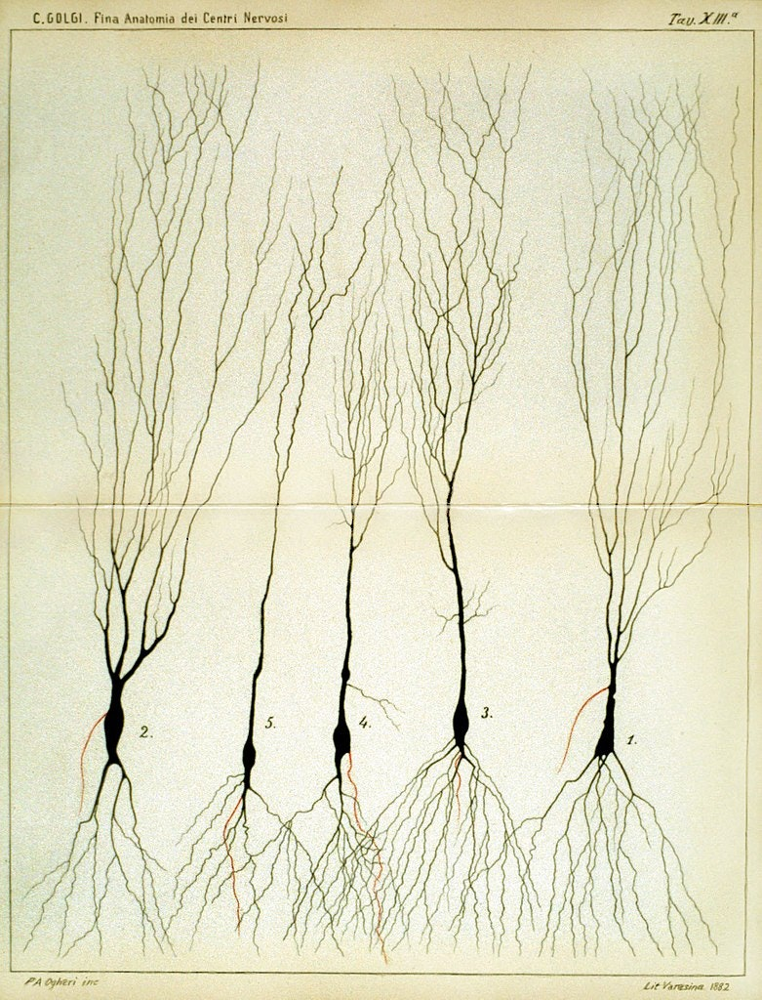
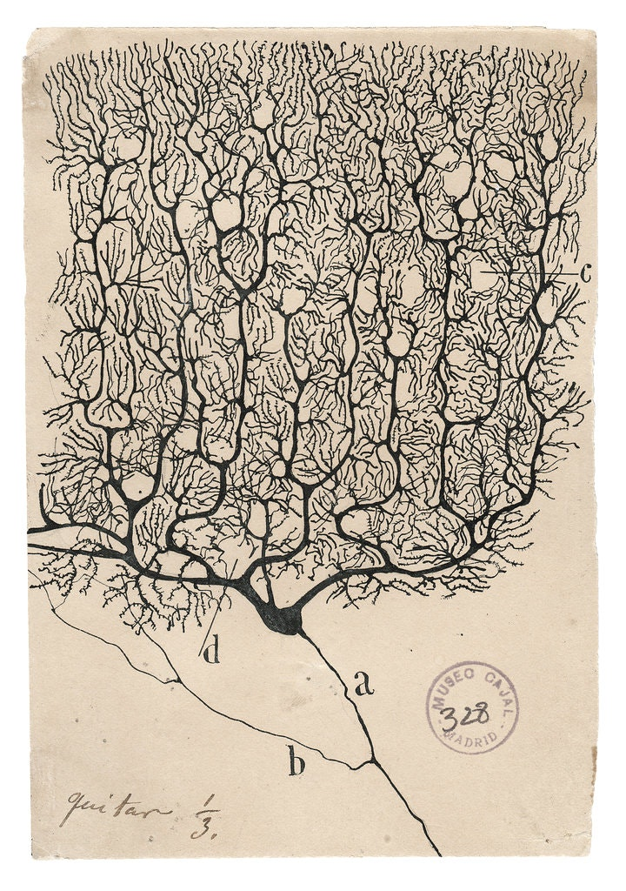
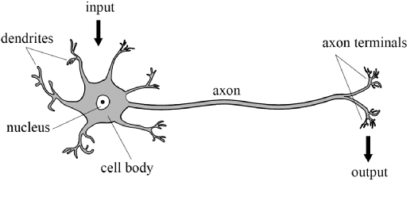

# The biological neuron

Enough of the flair. Let us get back to work. Previously we said that connectionism aims to simulate the structure of biological neuron in the brain, using the same function as it is. So, how is it, and what is the model of the biological neuron that we have? 
## From complex to simple model
Historically, the working mechanism and what we observe of the structure of neurons are fairly complex. The grandfather of neuroscience, Santiago Ramón y Cajal, and his 'opponent', Camillo Golgi, made substantial evidences and drawings of the complex web of neurons during the period. 

  <figure style="flex: 1;">
    
    <figcaption>Camillo Golgi (1885)</figcaption>
  </figure>

  <figure style="flex: 1;">
    
    <figcaption>Santiago Ramón y Cajal (1990)</figcaption>
  </figure>

<strong>Figure 1:</strong> Side-by-side illustration made by both Santiago Ramón y Cajal (1990) and Camillo Golgi (1885).

Informally, the brain encased the 'brain' - the nervous system in which defines its operation. This includes the central nervous system (CNS), and the peripheral nervous system (PNS). This is generally the conventional separation of the nervous system, as CNS includes the brain and spinal cord, while the peripheral nervous system consists of everything else. The CNS's responsibilities include receiving, processing, and responding to sensory information, while the peripheral, as its name, is similar to *control relay* and sensory influences. 

The brain is divided into two *hemispheres* (The reason is unknown for now, in terms of operational and evolutional accord), mainly for regional specialization. Between the two central hemispheres, they are connected by nerve bundles, in this case, is the thick band of fibres known as **corpus callosum**, consisting of about 200 million axons. The **axons** or **nerve fibre** is the long, slender projection of a nerve cell, or neuron, to different neurons and areas. So, think of it like a more extension cables from the transformer and generator. 

The **direction** between the 2 hemispherical connection is unknown, and can be either one-way, or two-way. But generally, we might want to take it as two-way, since it makes sense for when simultaneous tasks which requires multiple system on both sides to operates, remains so. Or rather, we can take it as the idea of **neural vacancy path**, that is, empty pathway that is one-directional specific in usage cases. More so like a conditional diode, depends on which way it was triggered first. But rather, it helps us to classify between the **communication directive** subjects, and **processing directive** subject of the brain.

The brain consists of a large number (approximately $10^{11}$) of highly connected neurons. For our purpose, we simplify them to mostly three principal components, beside its life support: the *dendrites*, the cell body and the **axon**. The dendrites are tree-like receptive networks of nerve fibres that carry electrical signals into the cell body. The cell model effectively sums and thresholds these incoming signals. The axon is simply, as we have said, the cord connecting other neurons to it. The point of contact between an axon of one cell and a dendrite of another cell is then called a **synapse**. It is the arrangement of neurons and the strengths of individual synapses, determined by a complex chemical process, that establishes the function of the biological neural network - though even by then, it is a gross simplification of the actual process - mostly based on empirical evidences. 

Aside from neuron, of the **cellular neurology** point of view, there exists also the **glia**, or **neuroglia** for the full name, which serves as the supporting cells for the operation of the main neurons' system. Specifically, the neuroglia should be emphasized to be rather inert - it does not align, or rather, can be classified as an operating unit in the brain, with respect to the well-known electrically excitable process that its brother neuron possesses. Indeed, because of such, there are many definitions in which neuroglia can take from, most of which are rather diluting, hence hitherto there are no agreed upon definition. In the above statement, we note that neuroglia as the supportive cells of neurons, but many exists to classify it by their process branching and delicate morphology, or, as mentioned, electrically inert components. As a result, 'neuroglia' has been come the generalized term that covers cells with different origins, morphology, physiological properties and functional specialization *aside from* the nervous cells of the brain. Such can be said of the uncertain analysis of neuroglia to the operation process and the long, complex chain of thoughts and functioning scheme of the host that it resides in, for whether the neuroglia participate in any incumbent roles throughout its working space. This is perhaps one of the issues with neuroglia researches, though it is not to say many attempts has been made trying to understand it, but rather the underrated position of the neuroglia to the other part of the brain itself. So, this much remains as a mystery. 

By itself, the brain's neuron and its neural structure is insanely complex. By time and birth, some of the neural structure is defined at birth. We don't know if this is encoded into itself by genes, but most likely so from biological evolutions itself. Other parts are developed through the dynamic action, often interpreted as learning (which is why we have the theory of learning), as new connections are made and others waste away. This development is most noticeable in the early stages of life. This is present in almost all developed neural structure of any given brain of any species. For example, it has been shown that if a young cat is denied use of one eye during a critical window of time, it will never develop normal vision in that eye. Linguists also have discovered that infants over six months of age can no longer discriminate certain speech sounds, unless they were exposed to them earlier in their life @@WERKER198449 . Somehow, it is also pretty vindictive to believe that the brain and all other functional components have a certain development timeframe deeply encoded in its biological encoding itself. Behaviourally, we can also interject that without pressure (like the fact that the cat must see, and must walk, so that it must move its legs and eyes), many functions would cease to be available. 

More of those illustrations can be found in [here](https://www.nytimes.com/2018/01/18/arts/design/brain-neuroscience-santiago-ramon-y-cajal-grey-gallery.html), [here](https://publicdomainreview.org/collection/illustrations-of-the-nervous-system-golgi-and-cajal/), [here](https://pmc.ncbi.nlm.nih.gov/articles/PMC2845060/), and some public repository holding such. Nevertheless, to prove such point, the structure and working of biological neurons constitute one of the most, if not seriously the most complex machine-type organism ever observed. If, one wish to develop or understand it, without having to remap the entire brain, one must be brave and better. To simplify the neuron, we adopt the simple construction with the most important parts being the *axon*, the *body*, and the *dendrite*. Symbolically, it is the $I/M/O$ schema, as the following indicate. 

<figure style="text-align: center;">
  
  <figcaption>
    <strong>Figure 2:</strong> The simplistic, schematic illustration of the structure of the biological neuron.
  </figcaption>
</figure>

This is the very run-down, simplistic view of a neuron, stripped down to its operational compartments and none of other flairs in between, which might as well create certainly a complex system of analysis. Nevertheless, we should not abandon such endeavour ourselves, because by virtue of anything and of the scientific method, reduction of complex model to simple one is imperative to understand, for else the flair of messiness in practice will overshadow what lies underneath. We have the *input*, coming in via the *dendrites*, into the main processing body of the cell, then transmitted to the axon to go out as the *output*. This fits with a type of model in mathematics, called **input-output model**, and such interpretation upon the machining of neuron would be used throughout the book. Our task is then to devise, certainly, a way to implement this into a computer functional. 